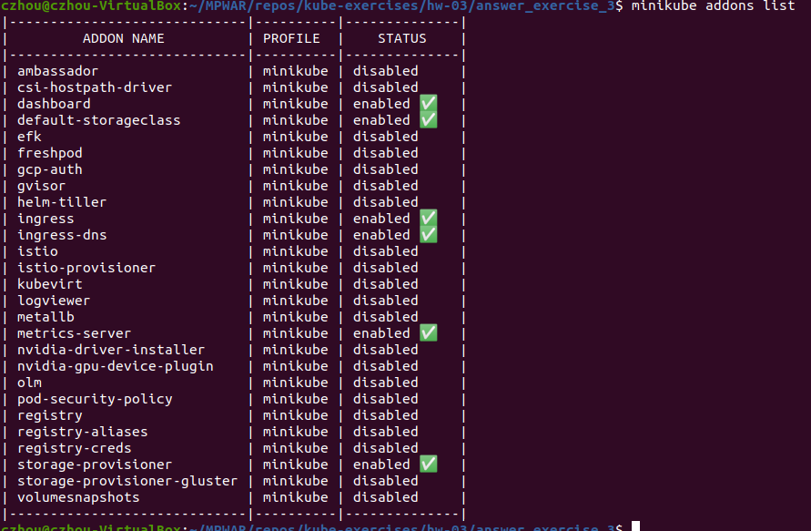
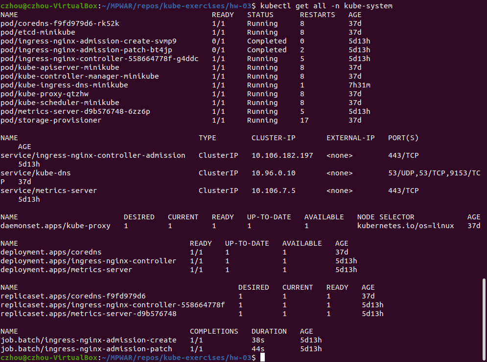

# kube-exercises

MPWAR - Entorno web

## índice

- hw-02: Kubernetes I
  - answer_exercise_1
  - answer_exercise_2
  - answer_exercise_3
  - answer_exercise_4
  - answer_exercise_5

- hw-03: Kubernetes II
  - answer_exercise_1
  - answer_exercise_2
  - answer_exercise_3
  
  Para estos ejercicios se han habilitado los addons de ingress y metrics-server.

  

  

- hw-05: CI/CD