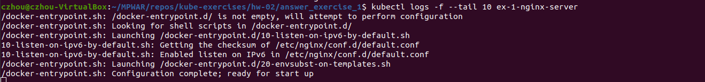
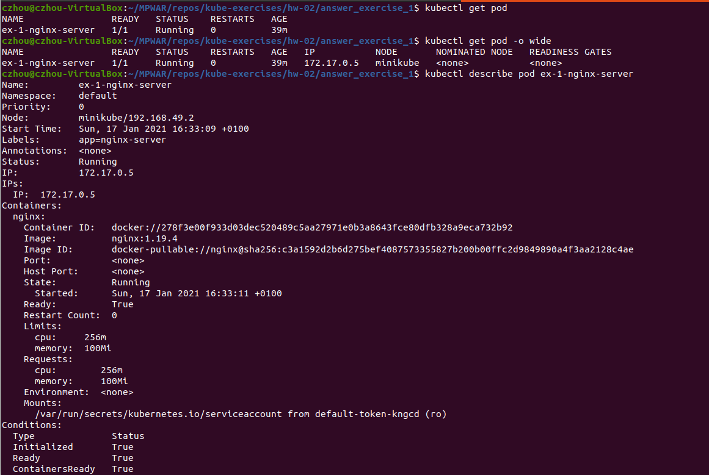
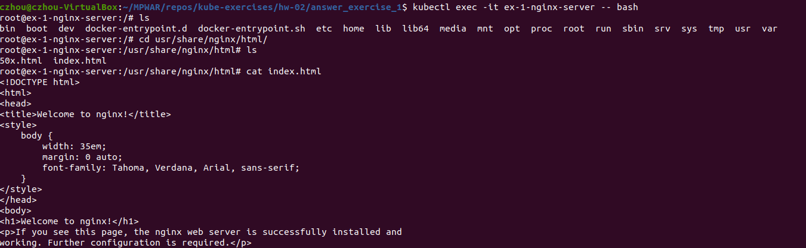
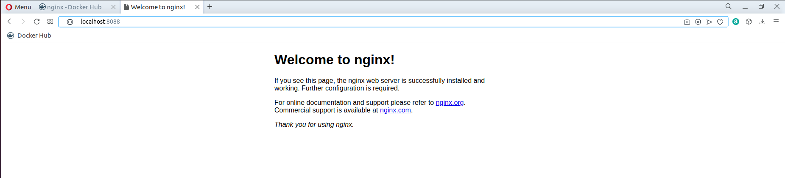
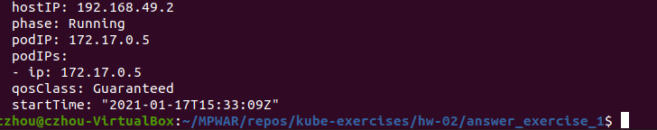

# hw-02-exercise-01

Crea un pod de forma declarativa con las siguientes especificaciones:

- Imagen: nginx
- Version: 1.19.4
- Label: app: nginx-server
- Limits
    - CPU: 100 milicores
    - Memoria: 256Mi
- Requests
    - CPU: 100 milicores
    - Memoria: 256Mi

Realiza un despliegue en Kubernetes, y responde a preguntas.

## Answer

Minifiesto yaml:
~~~~
apiVersion: v1
kind: Pod
metadata:
  name: ex-1-nginx-server
  labels: 
    app: nginx-server
spec:
  containers:
  - name: nginx
    image: nginx:1.19.6
    resources:
      limits:
        cpu: "256m"
        memory: "100Mi"
      requests:
        cpu: "256m"
        memory: "100Mi"
~~~~

Creamos el pod:
~~~~
  kubectl create -f pod.yaml
~~~~

Vemos que está corriendo:
~~~~
  kubectl get pod
~~~~

1. ¿Cómo puedo obtener las últimas 10 líneas de la salida estándar (logs generados por la aplicación)?

    ~~~
    kubectl logs -f --tail 10 ex-1-nginx-server
    ~~~

    

2. ¿Cómo podría obtener la IP interna del pod? Aporta capturas para indicar el proceso que seguirías.

    ~~~
    kubectl get pod -o wide
    ~~~
      - Podemos ver la IP en la columna _IP_

    ~~~
    kubectl describe pod ex-1-nginx-server
    ~~~
      - También podemos verla en el output resultante de ejecutar el comando _describe_.

    

3. ¿Qué comando utilizarías para entrar dentro del pod?

    ~~~
    kubectl exec -it ex-1-nginx-server -- bash
    ~~~

    

4. Necesitas visualizar el contenido que expone NGINX, ¿qué acciones debes llevar a cabo?

    Exponiendo el objeto de forma imperativa:
    ~~~
      kubectl get pod

      kubectl port-forward ex-1-nginx-server 8088:80

      curl http://localhost:8088
    ~~~
    
    

5. Indica la calidad de servicio (QoS) establecida en el pod que acabas de crear. ¿Qué lo has mirado?

    ~~~
    kubectl get pod ex-1-nginx-server -o yaml
    ~~~

    

    En el output vemos que _qosClass_ es _Guaranteed_.
    Esta calidad de servicio se da cuando el contenedor tiene una memoria de request que coincide con la memoria límite, y la CPU de request coincide con la CPU límite.

    La _qosClass_ sería _Burstable_ si el contenedor tuviera definido la memoria o la CPU de request.

    La _qosClass_ sería _BestEffort_ si el contenedor no tuviera definido ningún recurso de limit o request.
