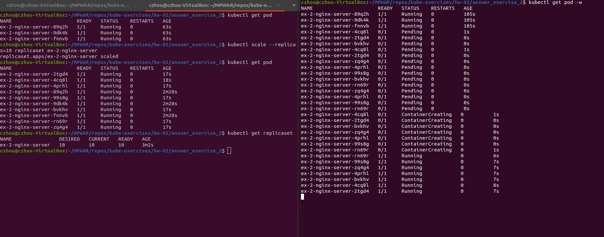

# hw-02-exercise-02

Crear un objeto de tipo replicaSet a partir del objeto anterior con las siguientes especificaciones:

- Debe tener 3 replicas
- ¿Cúal sería el comando que utilizarías para escalar el número de replicas a 10?
- Si necesito tener una replica en cada uno de los nodos de Kubernetes, ¿qué objeto se adaptaría mejor? (No es necesario adjuntar el objeto)

NOTA: Indica los comandos o ficheros que has utilizado

## Answer

Minifiesto yaml:
~~~~
apiVersion: apps/v1
kind: ReplicaSet
metadata:
  name: ex-2-nginx-server
  labels: 
    app: nginx-server
spec:
  replicas: 3
  selector:
    matchLabels:
      app: nginx-server
  template:
    metadata:
        labels:
          app: nginx-server
    spec:
      containers:
      - name: nginx
        image: nginx:1.19.6
        resources:
          limits:
            cpu: "256m"
            memory: "100Mi"
          requests:
            cpu: "256m"
            memory: "100Mi"
~~~~

Creamos el objeto:
~~~
kubectl create -f replicaset.yaml
~~~

Para escalar a 10 réplicas:
~~~
kubectl scale --replicas=10 replicaset ex-2-nginx-server
~~~

Para garantizar el emplazamiento de una réplica en cada uno de los nodos de Kubernetes, un objeto de tipo replicaset no nos serviría;
emplazaría las réplicas de forma “aleatoria” (según un algoritmo de Kubernetes). Tendríamos que recurrir a un objeto de tipo **DaemonSet**, que ubicaría una sola reṕlica en cada nodo.