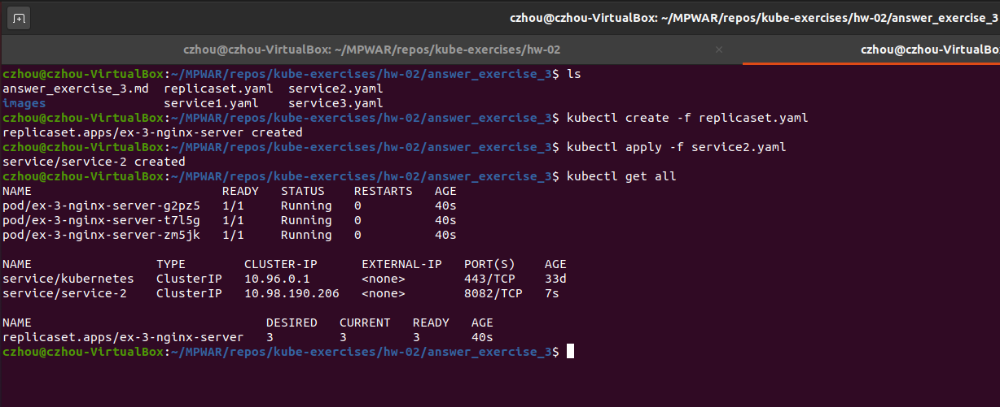
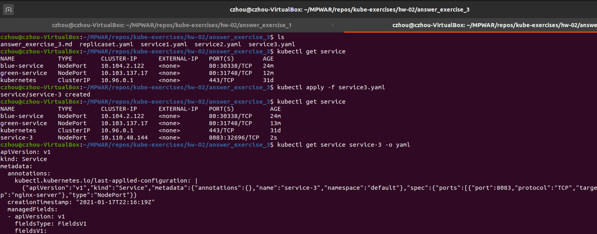
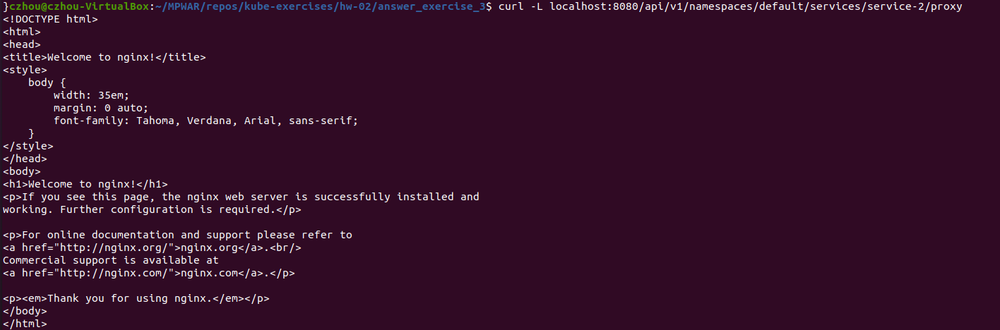

# hw-02-exercise-03

Crea un objeto de tipo service para exponer la aplicación del ejercicio anterior de las siguientes formas:

- Exponiendo el servicio hacia el exterior (crea service1.yaml)
- De forma interna, sin acceso desde el exterior (crea service2.yaml)
- Abriendo un puerto especifico de la VM (crea service3.yaml)

NOTA: Indica los comandos o ficheros que has utilizado

## Answer

### Service 1: Load Balancer

Exponiendo el servicio hacia el exterior (service1.yaml)
~~~~
apiVersion: v1
kind: Service
metadata:
  name: service-1
spec:
  type: LoadBalancer
  selector:
    app: nginx-server
  ports:
    - port: 8081
      targetPort: 80
~~~~
- Para este caso, el servicio que se consideraría sería de tipo LoadBalancer. Sin embargo, este tipo de servicios se usa para exponer en nubes públicas. En nuestro caso, trabajando en local con minikube, una alternativa para exponer la aplicación sería a través de un servicio tipo NodePort (ver en apartado _Service 3_
)

### Service 2: ClusterIP

De forma interna, sin acceso desde el exterior (service2.yaml)
~~~~
apiVersion: v1
kind: Service
metadata:
  name: service-2
spec:
  selector:
    app: nginx-server
  ports:
    - protocol: TCP
      port: 8082
      targetPort: 80
~~~~
- ClusterIP es el tipo de servicio por defecto (se puede especificar en el manifiesto pero no es necesario). Abre el acceso a la app dentro del cluster, sin acceso desde el exterior.

- Como solo es accesible desde el cluster, podemos iniciar un proxy entre entre el cluster y el host(_kubectl proxy --port=8080_). Con esto podemos realizar peticiones al localhost en el puerto especificado y obtener información del servicio.

### Service 3: NodePort

Abriendo un puerto especifico de la VM (service3.yaml)
~~~~
apiVersion: v1
kind: Service
metadata:
  name: service-3
spec:
  type: NodePort
  selector:
    app: nginx-server
  ports:
    - protocol: TCP
      port: 8083
      targetPort: 80
~~~~

- Una vez creado el service, podemos ver que es de tipo NodePort y que el puerto del nodo (asignado automáticamente dentro del rango 30000-32767 si no se especifica) es 32696.

- Sabiendo la IP de la máquina (en este caso, minikube) y el puerto del nodo, podemos ver lo que expone nuestra la aplicación. 

  