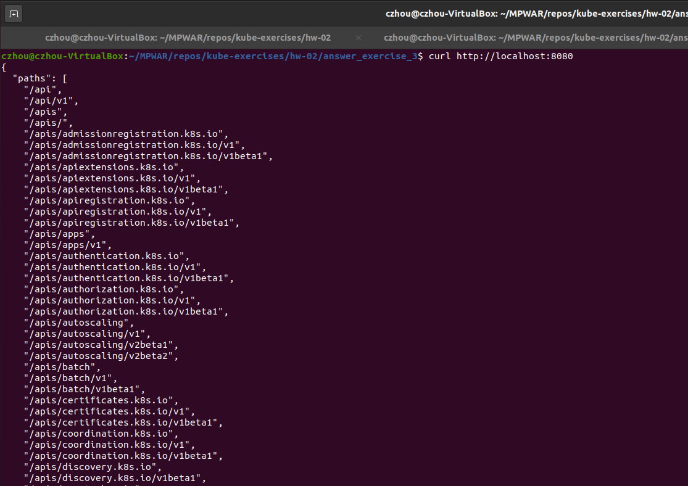

# hw-02-exercise-03

Crea un objeto de tipo service para exponer la aplicación del ejercicio anterior de las siguientes formas:

- Exponiendo el servicio hacia el exterior (crea service1.yaml)
- De forma interna, sin acceso desde el exterior (crea service2.yaml)
- Abriendo un puerto especifico de la VM (crea service3.yaml)

NOTA: Indica los comandos o ficheros que has utilizado

## Answer

### Service 1: Load Balancer

Exponiendo el servicio hacia el exterior (service1.yaml)
~~~~
apiVersion: v1
kind: Service
metadata:
  name: service-1
spec:
  selector:
    app: nginx-server
  ports:
    - protocol: TCP
      port: 8081
      targetPort: 80
~~~~

### Service 2: ClusterIP

De forma interna, sin acceso desde el exterior (service2.yaml)
~~~~
apiVersion: v1
kind: Service
metadata:
  name: service-2
spec:
  selector:
    app: nginx-server
  ports:
    - protocol: TCP
      port: 8082
      targetPort: 80
~~~~

### Service 3: NodePort

Abriendo un puerto especifico de la VM (service3.yaml)
~~~~
apiVersion: v1
kind: Service
metadata:
  name: service-3
spec:
  type: NodePort
  selector:
    app: nginx-server
  ports:
    - protocol: TCP
      port: 8083
      targetPort: 80
~~~~

- Una vez creado el service, podemos ver que es de tipo NodePort y que el puerto del nodo (asignado automáticament dentro de un rango) es 32696.

- Sabiendo la IP de la máquina y el puerto del nodo, podemos ver lo que expone nuestra la aplicación. 

  