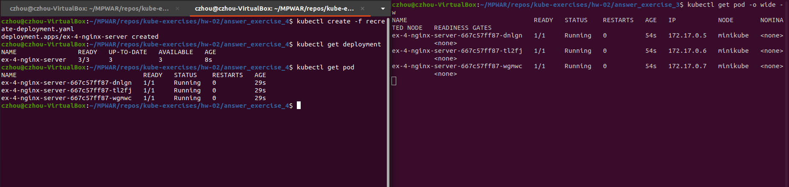
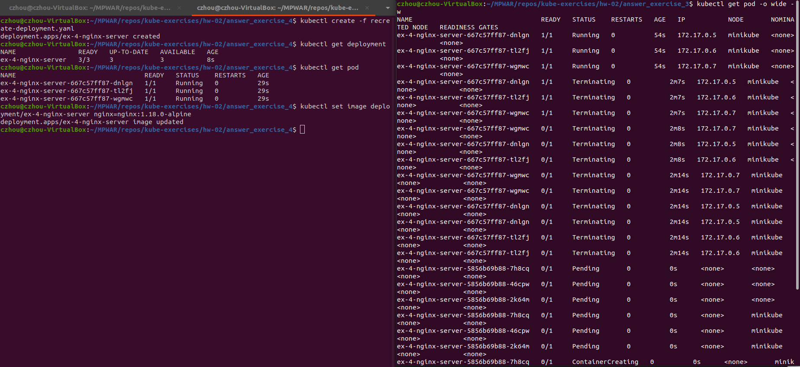
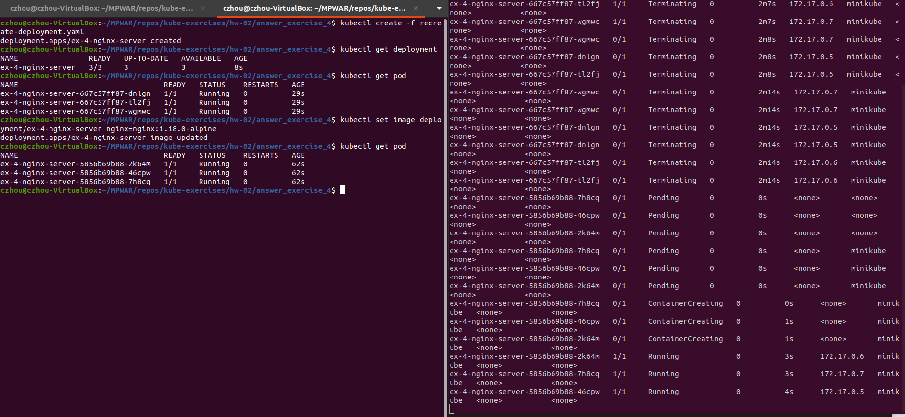
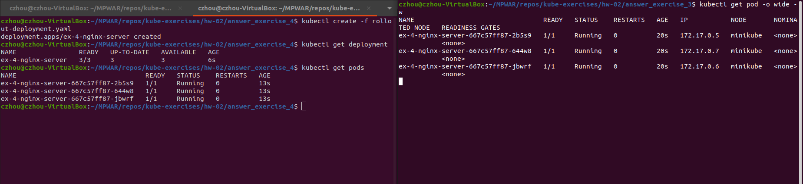
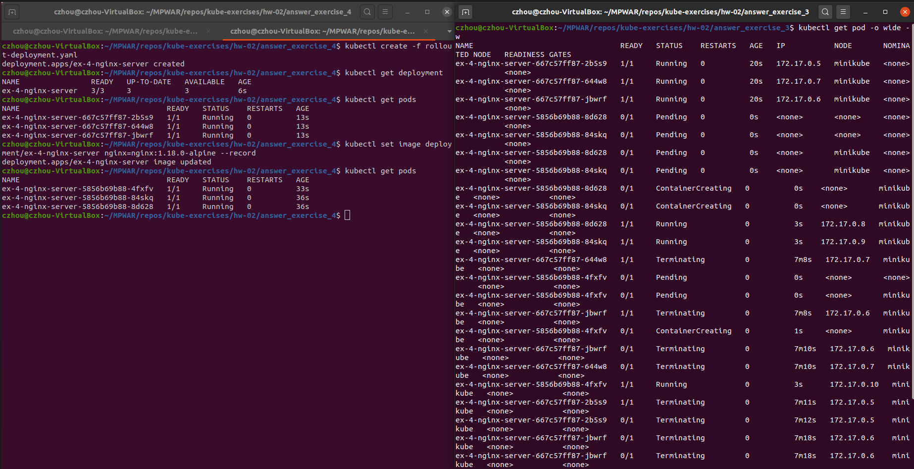
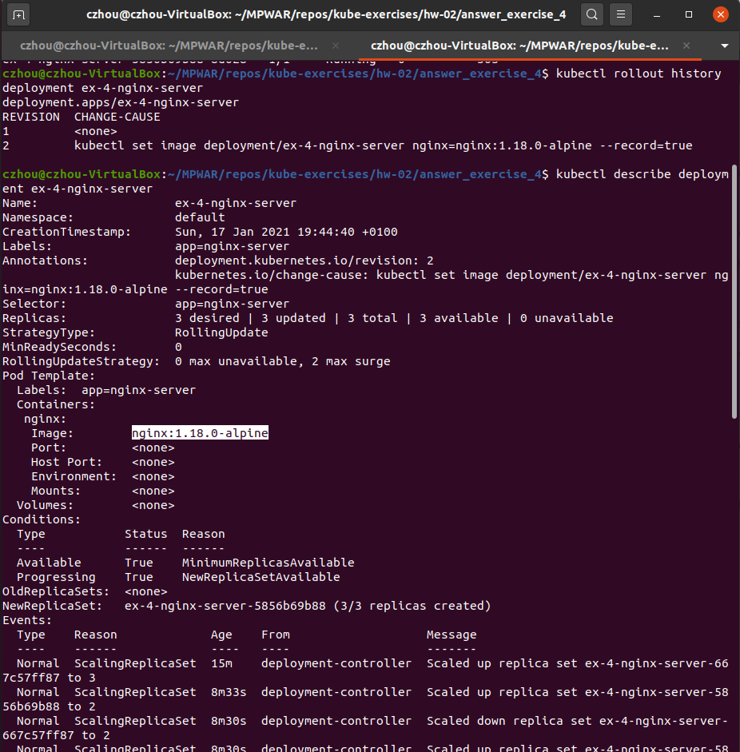
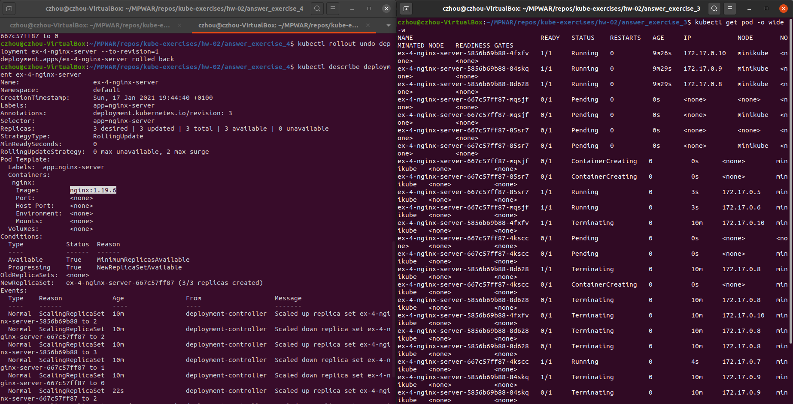

# hw-02-exercise-04

Crear un objeto de tipo deployment con las especificaciones del ejercicio 1:

- Despliega una nueva versión de tu nuevo servicio mediante la técnica “recreate”
- Despliega una nueva versión haciendo “rollout deployment”
- Realiza un rollback a la versión generada previamente

NOTA: Indica los comandos o ficheros que has utilizado

## Answer

### Recreate

Manifiesto yaml (recreate-deployment.yaml):
~~~~
apiVersion: apps/v1
kind: Deployment
metadata:
  name: ex-4-nginx-server
  labels: 
    app: nginx-server
spec:
  replicas: 3
  strategy:
    type: Recreate
  selector:
    matchLabels:
      app: nginx-server
  template:
    metadata:
      labels:
        app: nginx-server
    spec:
      containers:
      - image: nginx:1.19.6
        name: nginx
        resources:
          limits:
            cpu: "256m"
            memory: "100Mi"
          requests:
            cpu: "256m"
            memory: "100Mi"
~~~~

Creamos el objeto:
~~~
kubectl create -f recreate-deployment.yaml
~~~

Cambiamos la version de la imagen:
~~~
kubectl set image deployment/ex-4-nginx-server nginx=nginx:1.18.0-alpine
~~~

Vamos que se matan los pods existentes y luego se crean los nuevos:

### Rollout deployment

Manifiesto yaml (rollout-deployment.yaml):
~~~~
apiVersion: apps/v1
kind: Deployment
metadata:
  name: ex-4-nginx-server
  labels: 
    app: nginx-server
spec:
  replicas: 3
  strategy:
    type: RollingUpdate
    rollingUpdate:
      maxSurge: 2        
      maxUnavailable: 0 
  selector:
    matchLabels:
      app: nginx-server
  template:
    metadata:
      labels:
        app: nginx-server
    spec:
      containers:
      - image: nginx:1.19.6
        name: nginx
        resources:
          limits:
            cpu: "256m"
            memory: "100Mi"
          requests:
            cpu: "256m"
            memory: "100Mi"
~~~~
- Nota: configuramos el deployment para que no haya indisponibilidad (_maxUnavailable: 0_) y que se actualicen un máximo de 2 pods al mismo tiempo (_maxSurge: 2_).

Creamos el objeto:
~~~
kubectl create -f rollout-deployment.yaml
~~~

Cambiamos la version de la imagen:
~~~
kubectl set image deployment/ex-4-nginx-server nginx=nginx:1.18.0-alpine --record
~~~

Vamos que, a diferencia de la estrategia Recreate, lo primero que pasa no es que se eliminan los pods de la primera version, sino que se levantan los nuevos.

A la que ya tenemos dos pods de nueva versión corriendo, se comienzan a eliminar dos pods de la antigua versión. Hasta que ya solo tenemos pods de nueva versión y se han eliminado todos los de la antigua.

Con la opción _--record_ se han podido guardar los cambios a lo largo del deployment. Podemos consultar el historial ejecutando:

~~~
kubectl rollout history deployment ex-4-nginx-server
~~~

Para hacer un rollout a la versión anterior, simplemente ejecutamos:

~~~
kubectl rollout undo deployment ex-4-nginx-server --to-revision=1
~~~

Vemos que se vuelve a repetir el proceso de deployment visto anteriormente. La versión ahora vuelve a ser nginx:1.19.6
