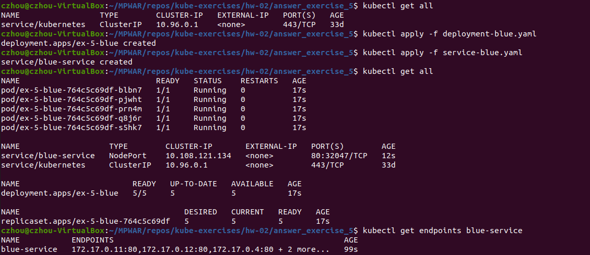

# hw-02-exercise-05

Diseña una estrategia de despliegue que se base en ”Blue Green”. Podéis utilizar la imagen del ejercicio 1.

Adjunta todos los ficheros para crear esta prueba de concepto.

## Answer

Estrategia:
- La versión Blue(1.18) está en producción.
- Levantamos la versión Green(1.19.6).
- Esperamos a que Green esté lista.
- Redirigimos el tráfico de Blue a Green.
- Bajamos la versión Blue.

Pasos a seguir:
1. Creamos el objeto deployment Blue
    ~~~
    kubectl apply -f deployment-blue.yaml
    ~~~
2. Creamos un servicio Blue que apunte al deployment Blue
    ~~~
    kubectl apply -f service-blue.yaml
    ~~~
    

    - _kubectl get service_: vemos que el service está expuesto en el 80 y en nuestra máquina minikube se le ha asignado el puerto 32047.
    - _kubectl get endpoints blue-service_: vemos los pods a los que se realizan las peticiones.

    

    - _export MINIKUBE_IP=$(minikube ip)_: extraemos a variable de entorno la IP de minikube
    - _echo $MINIKUBE_IP_: comprobamos el valor de la variable
    - _kubectl describe service blue-service_ / _kubectl get service blue-service -o json_: vemos detalles del servicio
    - _export PORT_BLUE=$(kubectl get service blue-service -o 'jsonpath={.spec.ports[0].nodePort}')_: extraemos el puerto a variable de entorno
    - echo $PORT_BLUE: comprobamos el valor de la variable
    - _while true; do curl ${MINIKUBE_IP}:${PORT_BLUE}/error; echo ‘\n’; sleep .5; done_: vemos que van cargando las versiones 1.18
3. Creamos el objeto deployment Green
    ~~~
    kubectl apply -f deployment-green.yaml
    ~~~
4. Creamos un servicio Green que apunte al deployment Green
    ~~~
    kubectl apply -f service-green.yaml
    ~~~
    

5. Hacemos que el servicio Blue apunte a la versión nueva:
    ~~~
    kubectl patch service blue-service -p '{"spec":{"selector":{"version": "1.19.6"}}}'
    ~~~

    

    - No seria necesario crear dos servicios (redirigiendo el primero ya vemos los cambios), pero considerando que probablemente querríamos acceder a la versión Green una vez desplegada para hacer pruebas, es buena práctica crear un servicio para ella.

6. Eliminamos los pods de la antigua versión:
    ~~~
    kubectl delete deployment ex-5-blue
    ~~~

    