# hw-03-exercise-01

[Ingress Controller / Secrets] Crea los objetos de forma declarativa con las siguientes especificaciones:

- Imagen: nginx
- Version: 1.19.4
- 3 replicas
- Label: app: nginx-server
- Exponer el puerto 80 de los pods
- Limits:
    - CPU: 20 milicores
    - Memoria: 128Mi
- Requests:
    - CPU: 20 milicores
    - Memoria: 128Mi

Tras haber expuesto el servicio en el puerto 80, se deberá acceder a la página principal.

Una vez realizadas las pruebas con el protocolo HTTP, se pide acceder al servicio mediante la utilización del protocolo HTTPS.

## Answer

Comenzamos con un objeto Deployment (nginx-deploy.yaml) en el namespace _sandbox_:
~~~
kubectl create namespace sandbox
kubectl create -f nginx-deploy.yaml -n sandbox
~~~
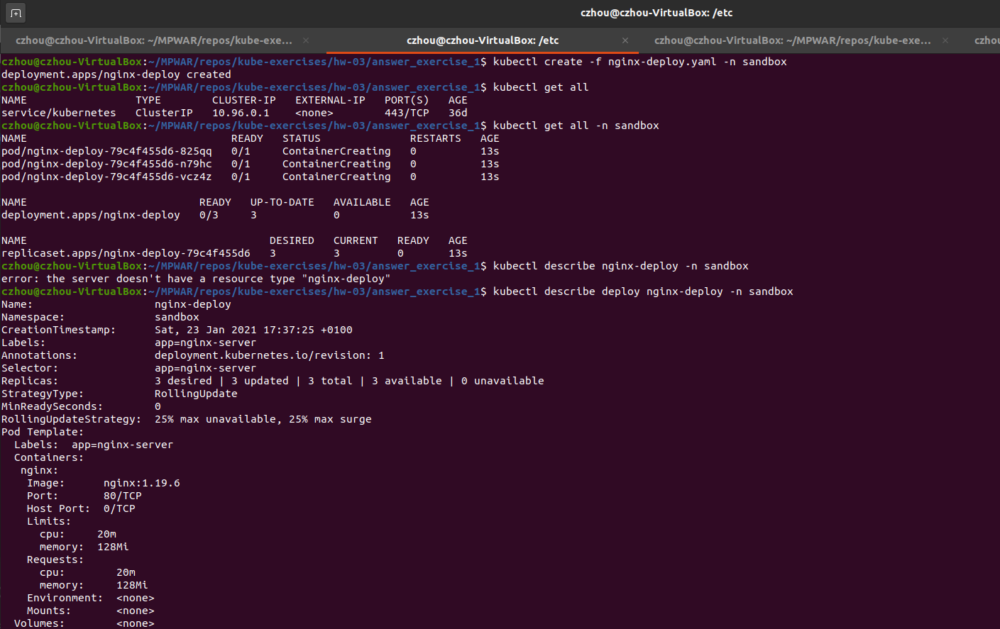

Creamos un servicio que apunte a los pods del deployment (a partir de nginx-svc.yaml o de forma imperativa):
~~~
kubectl expose deploy nginx-deploy --name nginx-svc --port=80 -n sandbox
kubectl get service -n sandbox
kubectl get endpoints nginx-svc -n sandbox
~~~
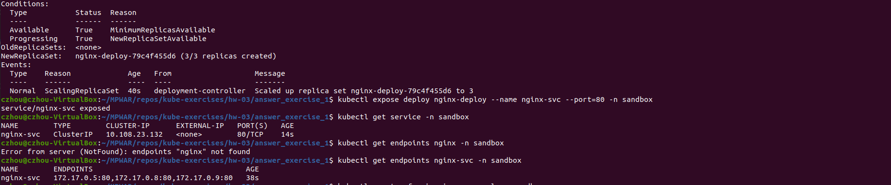

Creamos el objeto Ingress (nginx-ingress.yaml)
~~~
kubectl create -f nginx-ingress.yaml -n sandbox
kubectl get ingress nginx-ingress -n sandbox
~~~
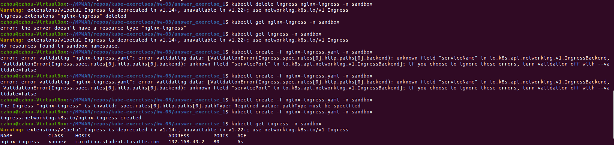

Accedemos a la página principal de dos maneras: 
- Navegador web --- URL: http://carolina.student.lasalle.com

    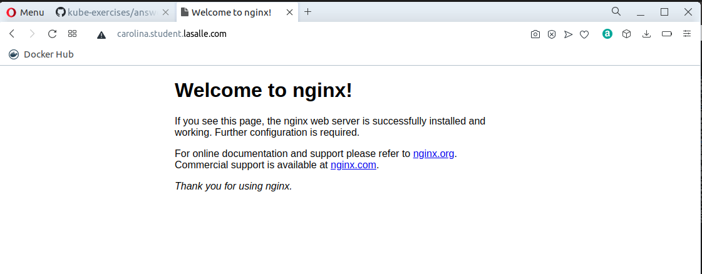

- Terminal --- Instrucción: curl -k http://carolina.student.lasalle.com

    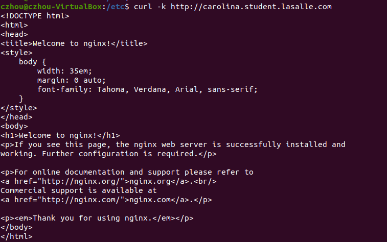

Herramientas como Gas Mask (Mac) nos facilitan este acceso a partir del DNS; no hace falta ejecutar un _port-forward_ (que es en localhost y no sirve realmente en el mundo de producción) ni hace falta crear un service (que nos da acceso con una dirección con formato &lt;nombre&gt;:&lt;puerto&gt;).

En este caso, se ha modificado el Hosts File por terminal, añadiendo el nombre de dominio _carolina.student.lasalle.com_ para que se traduzca como la ip de minikube:
~~~
sudo nano /etc/hosts
~~~
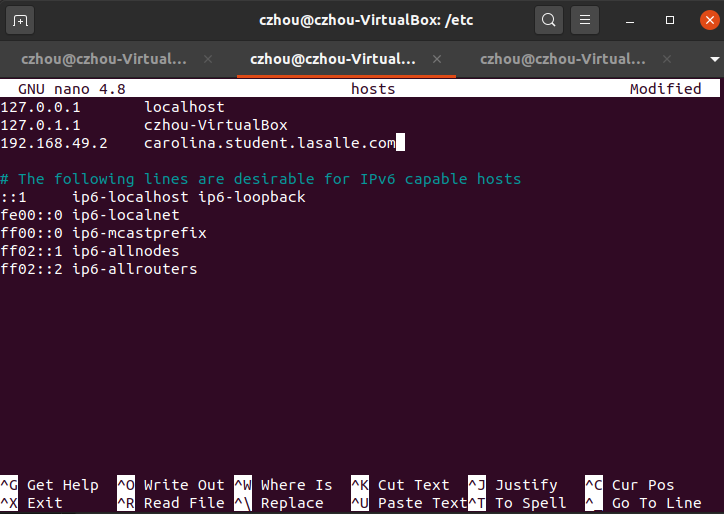

Este proceso no es seguro. Accederemos al servicio mediante protocolo HTTS creando un certificado y un Secret que lo contenga.
- Para crear el certificado se ha usado OpenSSL

    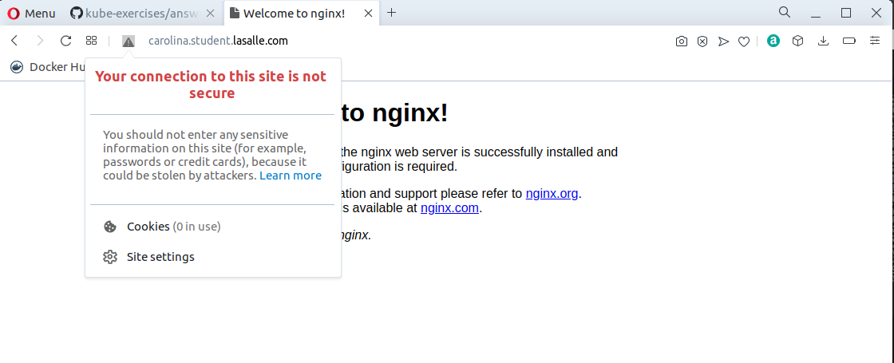

    ~~~
    cd certificate
    openssl req -x509 -nodes -days 365 -newkey rsa:2048 -keyout tls.key -out tls.crt -subj "/CN=carolina.student.lasalle.com"
    ~~~

    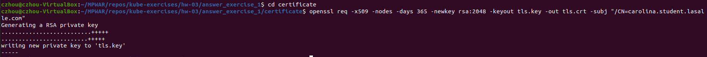

- Creamos un objeto Secret que contenga el certificado:
    ~~~
    kubectl create secret tls student-secret --key tls.key --cert tls.crt -n sandbox 
    ~~~

    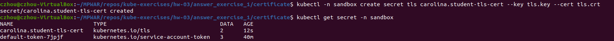

- Confirmamos la creación del secret:
    ~~~
    kubectl get secret student-secret -o yaml -n sandbox
    ~~~

    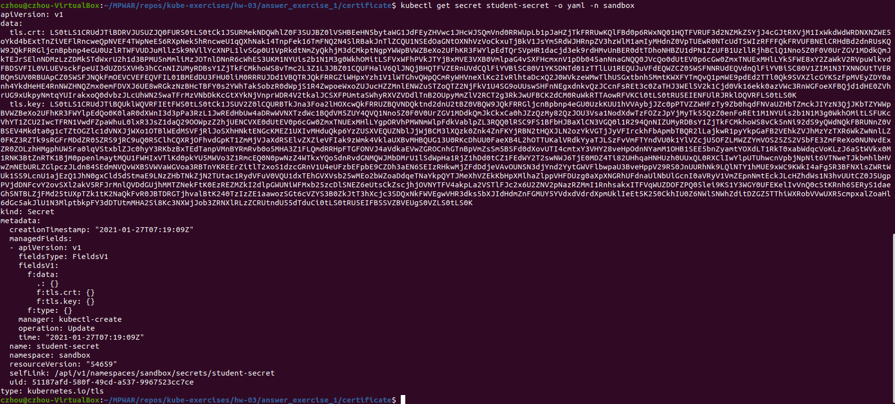

- Añadimos la referencia en el apartado _spec_ del manifiesto yaml del ingress controller(nginx-ingress-ssl.yaml):
    ~~~
    spec:
    tls:
    - hosts:
        - carolina.student.lasalle.com
        secretName: student-secret
    ~~~
    ~~~
    kubectl create -f nginx-ingress-ssl.yaml -n sandbox
    ~~~

    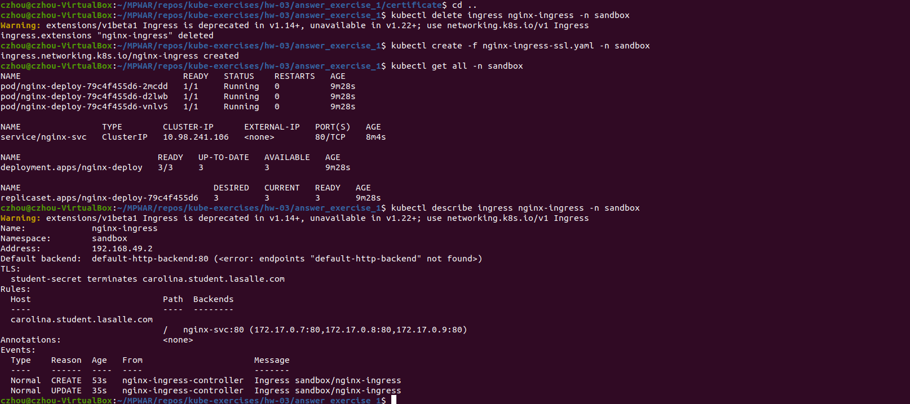

Validamos estos cambios por el navegador web. 
- Nos aparece un aviso porque el el certificado no está expedido por una entidad de confianza. Visitamos igualmente el sitio:

    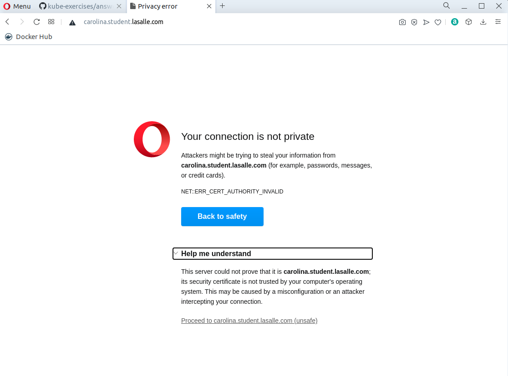

- Podemos comprobar que estamos accediendo mediante HTTPS y ver el certificado creado:

    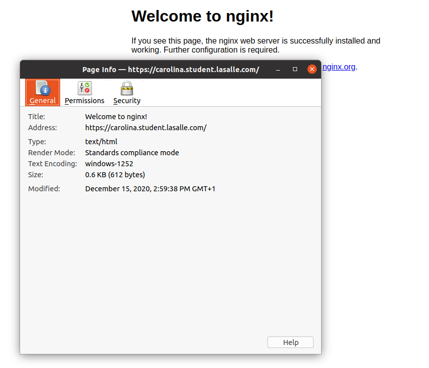

    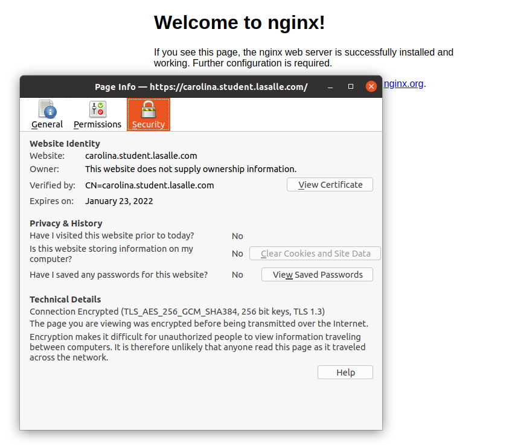

    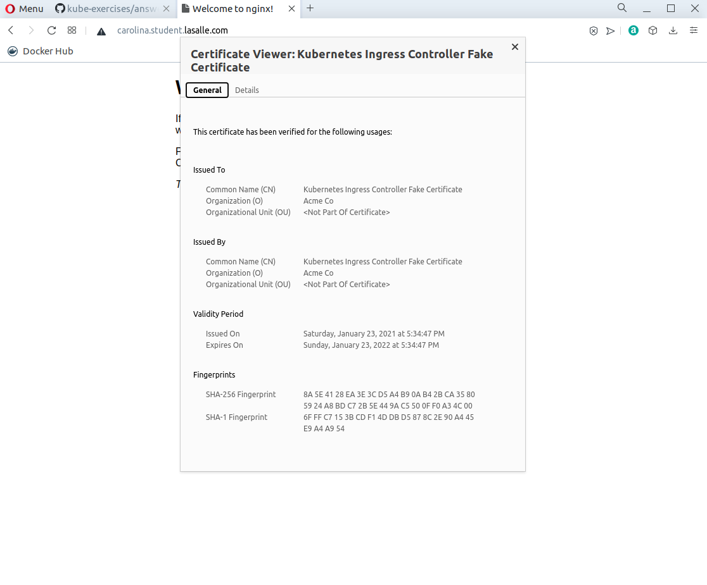

También podemos validarlo por terminal
~~~ 
cd certificate
curl --cacert tls.crt https://carolina.student.lasalle.com
~~~

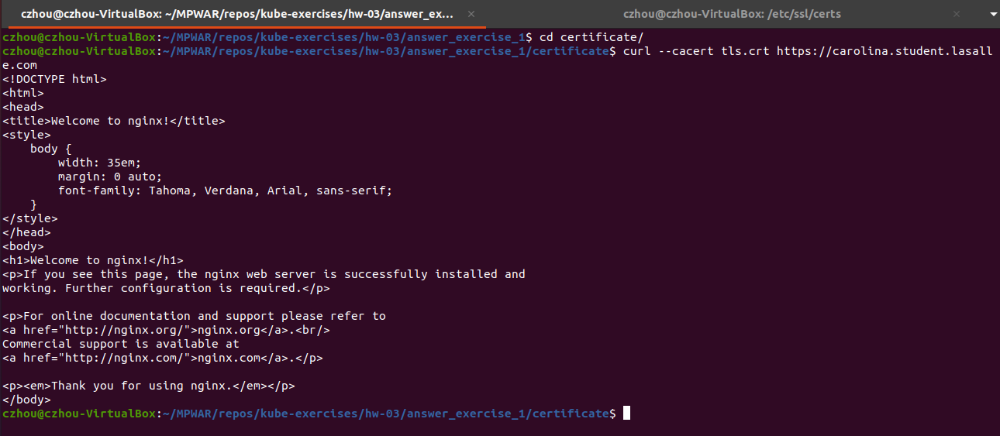

NOTE: para este ejercicio se han subido todos los archivos utilizados (incluyendo el certificado). En un caso real, dentro del paradigma de GitOps, idealmente se hubiese guardado el Secret de forma declarativa para contener esta información sensible. Para guardar este secret de forma segura en el repositorio, se hubiese utilizado un SealedSecret, para que solo el controlador del clúster pudiese desencriptarlo.