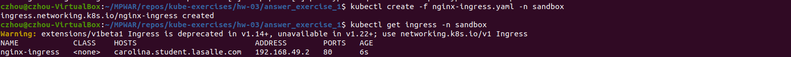

# hw-03-exercise-01

[Ingress Controller / Secrets] Crea los objetos de forma declarativa con las siguientes especificaciones:

- Imagen: nginx
- Version: 1.19.4
- 3 replicas
- Label: app: nginx-server
- Exponer el puerto 80 de los pods
- Limits:
    - CPU: 20 milicores
    - emoria: 128Mi
- Requests:
    - CPU: 20 milicores
    - Memoria: 128Mi

Tras haber expuesto el servicio en el puerto 80, se deberá acceder a la página principal.

Una vez realizadas las pruebas con el protocolo HTTP, se pide acceder al servicio mediante la utilización del protocolo HTTPS.

## Answer

Comenzamos con un objeto Deployment (nginx-deploy.yaml):
~~~
kubectl create namespace sandbox
kubectl create -f nginx-deploy.yaml -n sandbox
kubectl get all -n sandbox
kubectl describe deploy nginx-deploy -n sandbox
kubectl get pods -n sandbox -w
~~~

Creamos un servicio que apunte a los pods del deployment (a partir de nginx-svc.yaml o de forma imperativa):
~~~
kubectl expose deploy nginx-deploy --name nginx-svc --port=80 -n sandbox
kubectl get service -n sandbox
kubectl get endpoints nginx-svc -n sandbox
~~~

Creamos el objeto Ingress (nginx-ingress.yaml)
~~~
kubectl create -f nginx-ingress.yaml -n sandbox
kubectl get nginx-ingress -n sandbox
~~~

Accedemos a la página principal de dos maneras: 
- Navegador web - URL: http://carolina.student.lasalle.com

    

- Terminal - instrucción: curl -k http://carolina.student.lasalle.com

    

Herramientas como Gas Mask (macOS) nos facilitan este acceso a partir del DNS; no hace falta ejecutar un _port-forward_ (que es en localhost y no sirve realmente en el mundo de producción) ni hace falta crear un service (que nos da acceso con una dirección con formato &lt;nombre&gt;:&lt;puerto&gt;).

En este caso, se ha modificado el Hosts File por terminal, añadiendo el nombre de dominio _carolina.student.lasalle.com_ para que se traduzca como la ip de minikube:
~~~
sudo nano /etc/hosts
~~~

Este proceso no es seguro. Accederemos al servicio mediante protocolo HTTS creando un certificado y un Secret que lo contenga.
- Para crear el certificado se ha usado OpenSSL
~~~
cd certificate
openssl req -x509 -nodes -days 365 -newkey rsa:2048 -keyout tls.key -out tls.crt -subj "/CN=carolina.student.lasalle.com"
~~~

- Creamos un objeto Secret que contenga el certificado:
~~~
kubectl create secret tls carolina.student-tls-cert --key tls.key --cert tls.crt -n sandbox 
~~~

- Confirmamos la creación del secret:
~~~
 kubectl get secret carolina.student-tls-cert -o yaml -n sandbox
~~~

- Añadimos la referencia en Ingress el _spec_ del manifiesto (nginx-ingress-ssl.yaml):
~~~
spec:
  tls:
  - hosts:
      - carolina.student.lasalle.com
    secretName: carolina.student-tls-cert
~~~
~~~
kubectl create -f nginx-ingress-ssl.yaml -n sandbox
~~~

Validamos estos cambios por el navegador web. 
- En la barra superior podemos comprobar que estamos accediendo mediante HTTPS:

    

- Podemos ver el certificado creado:

    

También podemos validarlo por terminal
~~~ UPDATE CERTIFICATE FIELD
curl --cacert carolina.student-tls-cert https://carolina.student.lasalle.com
~~~