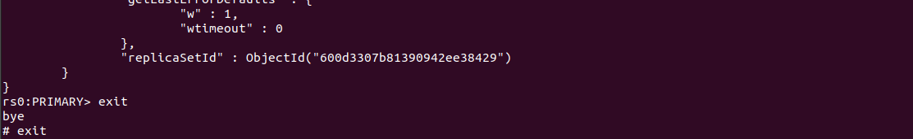
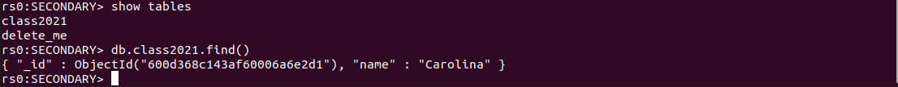

# hw-03-exercise-02

[StatefulSet] Crear un StatefulSet con 3 instancias de MongoDB. Se pide:
- Habilitar el clúster de MongoDB
- Realizar una operación en una de las instancias a nivel de configuración y verificar que el cambio se ha aplicado al resto de instancias
- Diferencias que existiría si el montaje se hubiera realizado con el objeto de ReplicaSet

## Answer

Creamos las réplicas (vemos que se crean de forma ordenada):
~~~
kubectl get pods -w (en otra ventana) 
kubectl create -f mongodb-statefulset.yaml
~~~

Creamos el servicio que estionará las IPs de los pods desplegados:
~~~
kubectl create -f mongodb-svc.yaml
kubectl get svc
kubectl get endpoints mongodb-svc
~~~

Ahora tenemos 3 réplicas que no están conectadas entre sí. Queremos un cluster que tenga alta disponibilidad, por lo que:
- Entramos dentro de un pod 
    ~~~
    kubectl exec -it mongo-statefulset-0 -- sh
    ~~~

- Accedemos al cliente de mongo 
    ~~~
    mongo
    ~~~

    

- Estamos conectados dentro de la primera réplica. Vemos que no está configurada la replicaSet con la mongoDB. Creamos el cluster con nuestras 3 réplicas:
    ~~~
    rs.status() 

    rs.initiate({_id: "rs0", version: 1, members: [
    { _id: 0, host : "mongo-statefulset-0.mongodb-svc.default.svc.cluster.local:27017" },
    { _id: 1, host : "mongo-statefulset-1.mongodb-svc.default.svc.cluster.local:27017" },
    { _id: 2, host : "mongo-statefulset-2.mongodb-svc.default.svc.cluster.local:27017" }
    ]});
    ~~~

    

- Vemos el cluster con las réplicas inicializadas
    ~~~
    rs.conf() 
    ~~~
    
    
    

Si operamos en una de las réplicas veremos que los cambios se aplican en las otras.

Podemos hacerlo directamente por terminal:

Para el ejercicio, levantamos express para hacerlo por UI:
~~~
kubectl create -f mongoexpress-deploy.yaml
kubectl port-forward podName 8088:8081
~~~

Añadimos una base de datos, creamos una nueva colección y añadimos un documento:
- Base de datos _students_
- Colección _Class\_2020-2021_
- Documento con _"name": "Carolina"_

Vemos este cambio en cualquiera de las instancias:

- Vemos la nueva base de datos y la nueva colección

- Al intentar acceder a la colección nos encontramos con un error por la sintaxis. Se opta por un cambio rápido en el nombre de la colección.

- Vemos el nombre de la colección actualizado. 
- Vemos el documento añadido.

Tenemos persistencia con _mountPath=/data/db_. 
- Vemos el cambio en el directorio tras añadir la base de datos.

    

    

    

- Si eliminamos el statefulset y lo volvemos a levantar, veremos que nuestros cambios han persistido.

    

    

Igual que en el momento de creación, si desescalamos a dos el número de réplicas veremos que se hace de forma ordenada, comenzando por la última intancia. Con un objeto de tipo ReplicaSet este (des)escalado hubiese sido aleatorio.

~~~
kubectl scale --replicas=2 statefulset mongo-statefulset
~~~

