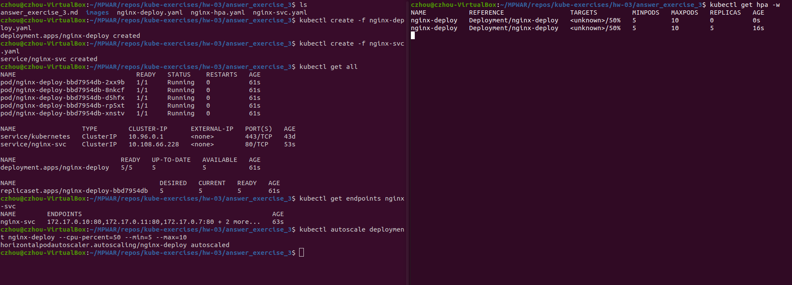

# hw-03-exercise-03

[Horizontal Pod Autoscaler] Crea un objeto de kubernetes HPA, que escale a partir de las métricas CPU o memoria (a vuestra elección). Establece el umbral al 50% de CPU/memoria utilizada, cuando pase el umbral, automáticamente se deberá escalar al doble de replicas.

Podéis realizar una prueba de estrés realizando un número de peticiones masivas mediante la siguiente instrucción:
kubectl run -i --tty load-generator --rm --image=busybox --restart=Never --/bin/sh -c "while sleep 0.01; do wget -q -O- http://&lt;svc_name&gt; done"

## Answer

Tenemos un deployment(nginx-deploy.yaml) y un servicio(nginx-svc.yaml). Desplegamos los pods y el servicio, y con el server corriendo ejecutamos:
~~~
kubectl autoscale deployment nginx-deploy --cpu-percent=50 --min=1 --max=10
~~~
- Se crea un Horizontal Pod Autoscaler. En el comando especificamos que se mantendrán entre 1 y 10 réplicas, escalando y desescalando para mantener un uso medio del 50% de CPU entre todas.

~~~
kubectl get hpa
~~~
- Comprobamos el status del autoscaler.

**TODO**: el consumo de CPU debería ser 0 porque no estamos realizando peticiones. Check why: UNKNOWN TARGET.

Incrementamos la carga para ver cómo trabaja el autoscaler:
~~~
kubectl run -i --tty load-generator --rm --image=busybox --restart=Never  -- sh -c "while sleep 0.01; do wget -q -O- http://nginx-svc; done"
~~~

Dando un margen de tiempo, podemos ver el incremento en uso de CPU:
~~~
kubectl get hpa
~~~

Vemos que cuando el consumo pasa del umbral, se han escalado las réplicas. En este caso, vemos que al 77% de CPU pasamos de 3 a 5 réplicas (no estamos controlan la cantidad de carga; lleva un tiempo estabilizar el número de réplicas). 

Acabamos con la carga que hemos forzado con un simple ctrl+C, dando un margen de tiempo, y volvemos a consultar el estado del deployment. 

**TODO**: CHECK ERROR en metrics server?
- metrics server enabled (minikube addons enable metrics-server)
- kubectl -n kube-system rollout status deployment metrics-server
- kubectl top nodes

**TODO**: podemos especificar a cuánto escalamos pasado el umbral?