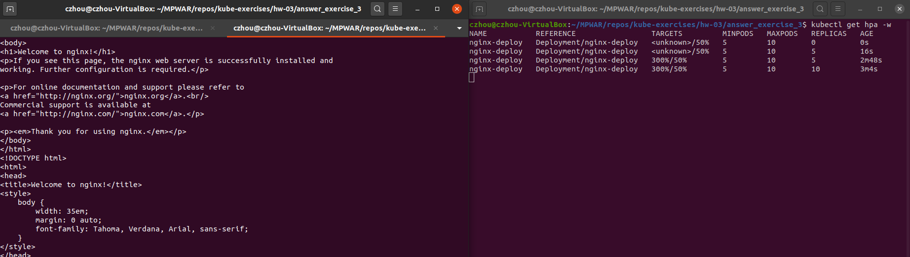

# hw-03-exercise-03

[Horizontal Pod Autoscaler] Crea un objeto de kubernetes HPA, que escale a partir de las métricas CPU o memoria (a vuestra elección). Establece el umbral al 50% de CPU/memoria utilizada, cuando pase el umbral, automáticamente se deberá escalar al doble de replicas.

Podéis realizar una prueba de estrés realizando un número de peticiones masivas mediante la siguiente instrucción:
kubectl run -i --tty load-generator --rm --image=busybox --restart=Never --/bin/sh -c "while sleep 0.01; do wget -q -O- http://&lt;svc_name&gt; done"

## Answer

Tenemos un deployment(nginx-deploy.yaml) y un servicio(nginx-svc.yaml). 

Desplegamos los pods y el servicio, y con el server corriendo podemos ejecutar:
~~~
kubectl autoscale deployment nginx-deploy --cpu-percent=50 --min=5 --max=10
~~~
- Se crea un Horizontal Pod Autoscaler con apiVersion autoscaling/V1. En el comando especificamos que se mantendrán entre 5 y 10 réplicas, escalando y desescalando para mantener un uso medio del 50% de CPU entre todas. Al pasar el umbral se escalarán las réplicas directamente al máximo especificado.
- También podemos probar con la versión autoscaling/v2beta2 partiendo del archivo nginx-hpa.yaml. Se escalará de forma progresiva.

- Comprobamos el status del autoscaler (_kubectl get hpa_).

Incrementamos la carga para ver cómo trabaja el autoscaler:
~~~
kubectl run -i --tty load-generator --rm --image=busybox --restart=Never  -- sh -c "while sleep 0.01; do wget -q -O- http://nginx-svc; done"
~~~
- Dando un margen de tiempo, podemos ver el incremento en uso de CPU:

    

- Vemos que cuando el consumo pasa del umbral, se han escalado las réplicas al máximo. Pasamos de 5 a 10 réplicas.

- Acabamos con la carga que hemos forzado y, dando un margen de tiempo, volvemos a consultar el estado del deployment. 

    