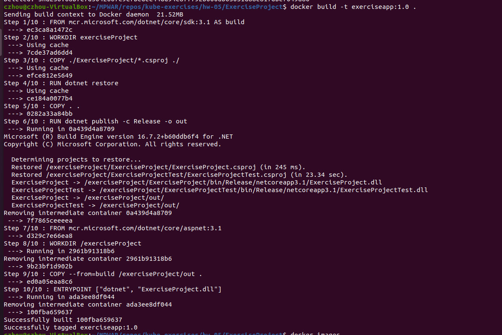

# hw-05

Diseña una pipeline que contenga las fases:
- Continuous Integration
- Continuous Delivery
- Continuous Deployment

Requerimientos:
- Diseñar pipeline desde la fase de construcción del proyecto hasta la fase de despliegue en Kubernetes
- Cada estudiante es libre de escoger la tecnología de su proyecto (Angular, React, Java, PHP, Golang, …)
- No se evaluará el código o el proyecto (puede ser un programa que imprima “Hello World!”)
- Explicar todas las tecnologías utilizadas para la fase de Continuous Integration (gestor de paquetes, tests unitarios, funcionales, …)
- Además del código, generar el fichero Dockerfile y los manifiestos de Kubernetes
- No es necesario instalar herramientas o lenguajes de programación. Para simular los comandos de cada fase, realizad un echo ‘<your_shell_command>’

## Answer

ExercisePorject
- Proyecto backend: C# / .NET Core 3.1
- WeatherForecast API 

JenkinsFile
~~~
~~~

Fases
- Continuous Integration
    - Build
    - Test

- Continuous Delivery
    - Automatic release to repository

- Continuous Deployment
    - Automatic deploy to environment

Stages
1. Checkout: checkout/clon del código de Git al agente especificado.
2. Nuget Restore: descargamos/restoreamos paquetes NuGet especificados en el proyecto.
3. Clean: limpiamos la solución.
4. Build: construimos la solución con comandos CLI dotnet. Se guardarán dlls y otros archivos del build en bin\Debug\netcoreapp2.x. En este stage también se podría añadir SonarQube para automatizar el code quality performance testing.
5. UnitTests: pasamos los tests funcionales de la solución con dotnet test o MSTest. Para el proyecto de test se usa xUnit, con herramientas como NSUbstitute, FluentAssertions y ApprovalTests.
6. IntegrationTests: de la misma manera, pasamos los tests de integración.
7. Publish: build + packing de la aplicación y todas sus dependencias en una carpeta preparada para publicar.
8. Docker: construimos la imagen a partir del Dockerfile (multi-stage).
- Stage 1 - Construimos la app y situamos los archivos correspondientes
    - Partimos de la imagen mcr.microsoft.com/dotnet/core/sdk:3.1
    - Copiamos el archivo .cspoj del proyecto y ejecutamos un restore de las dependencias.
    - Copiamos el resto de archivos y construimos el proyecto, poniéndolo todo en el directorio especificado.
- Stage 2 - Run
    - Partimos de la imagen mcr.microsoft.com/dotnet/core/sdk:3.1
    - Creamos el working directory ExerciseProject
    - Copiamos los archivos del build del primer stage en dicho directorio.
    - Especificamos el entrypoint para ejecutar la app al iniciar el contenedor.
9. Push: hacemos login a DockerHub y subimos la imagen al repositorio.
    - docker login
    - docker tag exerciseapp:1.0 czhoulin/exerciseapp
    - docker push czhoulin/exerciseapp
10. Deploy: deployamos al entorno de Kubernetes.

Extras: notificación por slack, ansicolor, libreria externa para usar métodos de construcción, testing, etc.

Construimos la imagen y la vemos listada
~~~
docker build -t exerciseapp:1.0 .
docker images
~~~

Arrancamos el contenedor y lo vemos listado
~~~
docker run -d -p 8080:80 --name weatherforecast exerciseapp:1.0
docker ps
~~~

