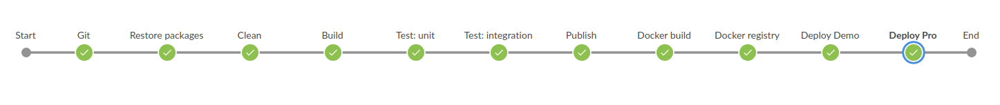
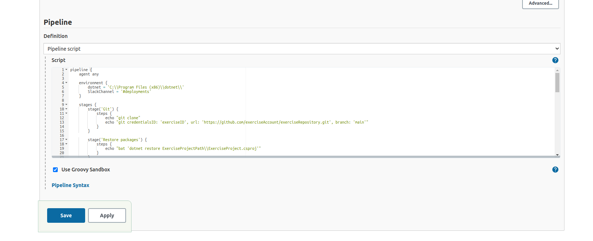
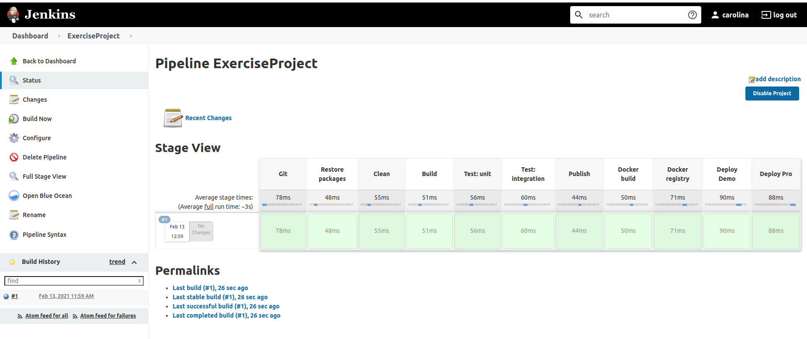

# hw-05

Diseña una pipeline que contenga las fases:
- Continuous Integration
- Continuous Delivery
- Continuous Deployment

Requerimientos:
- Diseñar pipeline desde la fase de construcción del proyecto hasta la fase de despliegue en Kubernetes
- Cada estudiante es libre de escoger la tecnología de su proyecto (Angular, React, Java, PHP, Golang, …)
- No se evaluará el código o el proyecto (puede ser un programa que imprima “Hello World!”)
- Explicar todas las tecnologías utilizadas para la fase de Continuous Integration (gestor de paquetes, tests unitarios, funcionales, …)
- Además del código, generar el fichero Dockerfile y los manifiestos de Kubernetes
- No es necesario instalar herramientas o lenguajes de programación. Para simular los comandos de cada fase, realizad un echo ‘<your_shell_command>’

## Answer

ExercisePorject
- Proyecto backend: C# / .NET Core 3.1
- WeatherForecast API 

Fases
- Continuous Integration
    - Build
    - Test

- Continuous Delivery
    - Automatic release to repository

- Continuous Deployment
    - Automatic deploy to environment

Stages
1. Git: podemos empezar con un checkout/clon del código de Git al agente especificado.
    - Nota: el comando que se simula en el Jenkinsfile ejemplifica el proceso con una cuenta no real.

2. Restore packages: descargamos/restoreamos paquetes NuGet especificados en el proyecto.

3. Clean: limpiamos la solución.

4. Build: construimos la solución con comandos CLI dotnet. Se guardarán dlls y otros archivos del build en bin\Debug\netcoreapp2.x. En este stage también se podría añadir SonarQube para automatizar el code quality performance testing.

5. Test-unit: pasamos los tests funcionales de la solución con dotnet test o MSTest. Para el proyecto de test se usa xUnit, con herramientas como NSUbstitute, FluentAssertions y ApprovalTests.

6. Test-integration: de la misma manera, pasamos los tests de integración. Aquí, aparte de las herramientas mencionadas anteriormente, vemos 
otras como TestServer (servidor de pruebas en memoria). En las pruebas de integración, para los componentes como el host web del SUT o el test server, se utilizarían paquetes como Microsoft.AspNetCore.Mvc.Testing.
    - Nota: tanto para los tests unitarios como los de integración, los comandos que se simulan en el Jenkinsfile ejemplifican el proceso de forma muy simplificada. La ejecución de los tests admite muchas opciones. En los comandos también se pasan ejemplos de proyectos de test (ExerciseProjectUnitTest y ExerciseProjectIntegrationTest) no reales (en la solución adjunta tenemos solo un ExerciseProjectTest).

7. Publish: build + packing de la aplicación y todas sus dependencias en una carpeta preparada para publicar.

8. Docker build: construimos la imagen a partir del Dockerfile (multi-stage)
    - Nota: Si trabajamos con Jekins a través de Docker, no se podrá ejecutar este stage con Docker (Docker-in-Docker). Como alternativa, podríamos usar Kaniko, otra herramienta que permite construir imágenes a partir de un Dockerfile.

9. Docker registry: hacemos login a DockerHub y subimos la imagen al repositorio.

10. Deploy Demo: deployamos al entorno de demo en Kubernetes.

11. Deploy Pro: deployamos al entorno deproducción en Kubernetes.

## Simulation

- Levantamos jenkins
    ~~~
    docker run -p 8080:8080 -p 5000:5000 jenkins/jenkins:alpine
    ~~~

    

- Copiamos la contraseña facilitada tras el build y seguimos el proceso

    

    

    

- Creamos el admin user

    

    

- Aplicamos nuesro script

    

    

    

## Annex

Comprobación del funcionamiento de la app contenerizada

- Dockerfile
    - Stage 1
        - Partimos de la imagen especificada.
        - Copiamos el archivo .cspoj del proyecto y ejecutamos un restore de las dependencias.
        - Copiamos el resto de archivos y construimos el proyecto, poniéndolo todo en el directorio especificado.
    - Stage 2 
        - Partimos de la imagen especificada.
        - Creamos el working directory ExerciseProject
        - Copiamos los archivos del build del primer stage en dicho directorio.
        - Especificamos el entrypoint para ejecutar la app al iniciar el contenedor.
- Construimos la imagen y la vemos listada
    ~~~
    docker build -t exerciseapp:1.0 .
    docker images
    ~~~

    

    

- Arrancamos el contenedor y lo vemos listado
    ~~~
    docker run -d -p 8080:80 --name weatherforecast exerciseapp:1.0
    docker ps
    ~~~

    

- Accesible desde el navegador

    

- Subimos la imagen al repositorio
    ~~~
    docker login
    docker tag exerciseapp:1.0 carolinazzz/exerciseapp:1.0 
    docker push carolinazzz/exerciseapp:1.0
    ~~~

    

- Creamos los objetos deployment (los contenedores parten de la imagen subida) y service
    ~~~
    kubectl create -f exerciseProject-deployment.yml
    kubectl get deployment
    kubectl create -f exerciseProject-service.yml
    kubectl get svc
    ~~~

    

- Accedemos desde el navegador

    